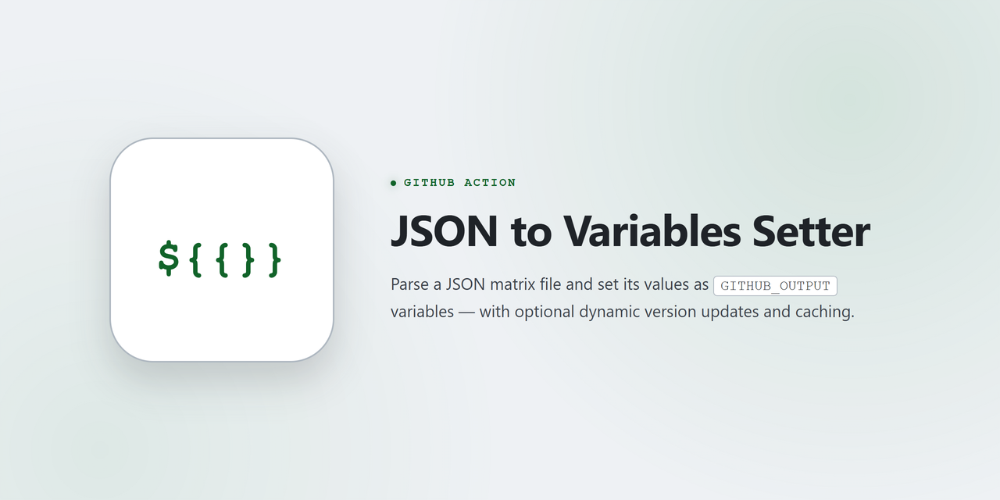

# JSON to Variables Setter

<picture>
  <source media="(prefers-color-scheme: dark)" srcset="docs/assets/img/banner-dark.png">
  <source media="(prefers-color-scheme: light)" srcset="docs/assets/img/banner-light.png">
  
</picture>

<details>
<summary>Project Info</summary>
<p align="center">
<a href="https://github.com/marketplace/actions/json-to-variables-setter"></a>
<a href="https://7rikazhexde.github.io/json2vars-setter/"></a>
<a href="https://github.com/7rikazhexde/json2vars-setter/blob/main/LICENSE"></a>
<br/>
<a href="https://github.com/7rikazhexde/json2vars-setter/actions/workflows/prch_test_matrix_json.yml"></a>
<a href="https://www.python.org"></a>
<br/>
<a href="https://github.com/astral-sh/uv"></a>
<a href="https://github.com/astral-sh/ruff"></a>
<a href="https://mypy-lang.org/"></a>
<a href="https://github.com/astral-sh/ty"></a>
<a href="https://github.com/crate-ci/typos"></a>
<a href="https://github.com/pre-commit/pre-commit"></a>
<br/>
<a href="https://github.com/zizmorcore/zizmor"></a>
<a href="https://github.com/gitleaks/gitleaks"></a>
</p>
</details>

## Overview

**JSON to Variables Setter (json2vars-setter)** is a GitHub Action that parses a JSON file and sets its values as output variables in GitHub Actions workflows. This action streamlines the management of matrix testing configurations and other workflow variables, making your CI/CD processes more maintainable and adaptable.

By centralizing your configuration in JSON files, you gain the ability to easily manage and update testing environments across multiple workflows, reducing duplication and maintenance overhead.

## Table of Contents

- [JSON to Variables Setter](#json-to-variables-setter)
  - [Overview](#overview)
  - [Table of Contents](#table-of-contents)
  - [Key Features](#key-features)
  - [Supported Matrix Components](#supported-matrix-components)
  - [Sample Workflows](#sample-workflows)
  - [Quick Start](#quick-start)
  - [Components](#components)
  - [Documentation](#documentation)
  - [License](#license)

## Key Features

- **JSON Parsing**: Convert JSON files into GitHub Actions output variables for use in your workflows
- **Dynamic Version Management**: Automatically update your testing matrix with latest language versions from official sources
- **Version Caching**: Cache version information to reduce API calls and improve workflow performance
- **Support for Multiple Languages**: Compatible with Python, Ruby, Node.js, Go, Rust, PHP, .NET (C#), Java, Deno, Bun, Zig, Elixir, Dart, Swift, Julia, Crystal, Haskell, OCaml, Kotlin, Flutter, and the Clang/LLVM and GCC C++ compilers
- **Flexible Configuration**: Maintain a single source of truth for your matrix testing environments

## Supported Matrix Components

| Languages | Actions | Example Test Status |
|-------|-------|-------|
|  | [](https://github.com/marketplace/actions/setup-python) | [](https://github.com/7rikazhexde/json2vars-setter/actions/workflows/python_test.yml) |
|  | [](https://github.com/marketplace/actions/setup-ruby-jruby-and-truffleruby) | [](https://github.com/7rikazhexde/json2vars-setter/actions/workflows/ruby_test.yml) |
|  | [](https://github.com/marketplace/actions/setup-node-js-environment) | [](https://github.com/7rikazhexde/json2vars-setter/actions/workflows/nodejs_test.yml) |
|  | [](https://github.com/marketplace/actions/setup-go-environment) | [](https://github.com/7rikazhexde/json2vars-setter/actions/workflows/go_test.yml) |
|  | [](https://github.com/marketplace/actions/rustup-toolchain-install) | [](https://github.com/7rikazhexde/json2vars-setter/actions/workflows/rust_test.yml) |
|  | [](https://github.com/marketplace/actions/setup-php-action) | [](https://github.com/7rikazhexde/json2vars-setter/actions/workflows/php_test.yml) |
|  | [](https://github.com/marketplace/actions/setup-net-core-sdk) | [](https://github.com/7rikazhexde/json2vars-setter/actions/workflows/dotnet_test.yml) |
|  | [](https://github.com/marketplace/actions/setup-java-jdk) | [](https://github.com/7rikazhexde/json2vars-setter/actions/workflows/java_test.yml) |
|  | [](https://github.com/marketplace/actions/setup-deno) | [](https://github.com/7rikazhexde/json2vars-setter/actions/workflows/deno_test.yml) |
|  | [](https://github.com/marketplace/actions/setup-bun) | [](https://github.com/7rikazhexde/json2vars-setter/actions/workflows/bun_test.yml) |
|  | [](https://github.com/marketplace/actions/setup-zig-compiler) | [](https://github.com/7rikazhexde/json2vars-setter/actions/workflows/zig_test.yml) |
|  | [](https://github.com/marketplace/actions/setup-beam) | [](https://github.com/7rikazhexde/json2vars-setter/actions/workflows/elixir_test.yml) |
|  | [](https://github.com/marketplace/actions/setup-dart-sdk) | [](https://github.com/7rikazhexde/json2vars-setter/actions/workflows/dart_test.yml) |
|  | [](https://github.com/marketplace/actions/setup-swift) | [](https://github.com/7rikazhexde/json2vars-setter/actions/workflows/swift_test.yml) |
|  | [](https://github.com/marketplace/actions/setup-julia-environment) | [](https://github.com/7rikazhexde/json2vars-setter/actions/workflows/julia_test.yml) |
|  | [](https://github.com/marketplace/actions/install-crystal) | [](https://github.com/7rikazhexde/json2vars-setter/actions/workflows/crystal_test.yml) |
|  | [](https://github.com/marketplace/actions/setup-haskell) | [](https://github.com/7rikazhexde/json2vars-setter/actions/workflows/haskell_test.yml) |
|  | [](https://github.com/marketplace/actions/set-up-ocaml) | [](https://github.com/7rikazhexde/json2vars-setter/actions/workflows/ocaml_test.yml) |
|  | [](https://github.com/JetBrains/kotlin/releases) | [](https://github.com/7rikazhexde/json2vars-setter/actions/workflows/kotlin_test.yml) |
|  | [](https://github.com/aminya/setup-cpp) | [](https://github.com/7rikazhexde/json2vars-setter/actions/workflows/clang_test.yml) |
|  | [](https://github.com/aminya/setup-cpp) | [](https://github.com/7rikazhexde/json2vars-setter/actions/workflows/gcc_test.yml) |
|  | [](https://github.com/subosito/flutter-action) | [](https://github.com/7rikazhexde/json2vars-setter/actions/workflows/flutter_test.yml) |

> 📖 **Per-language details** — supported OS, versions, and the setup action each example drives — are on the [Languages](https://7rikazhexde.github.io/json2vars-setter/languages/) section of the documentation.

## Sample Workflows

Beyond the per-language tests above, these **runnable use-case samples** live in this repository and execute on real GitHub Actions. The green badge is proof you can reproduce the result, then copy the files into your own project — no local setup required to gain confidence.

| Use case | Status | What it demonstrates | Files |
|----------|--------|----------------------|-------|
| [Single source of truth](https://7rikazhexde.github.io/json2vars-setter/features/json-to-variables/) | [](https://github.com/7rikazhexde/json2vars-setter/actions/workflows/sample_single_source.yml) | One JSON parsed once, then consumed by an independent `test` matrix **and** a separate `lint` job — define versions in one place, use them everywhere | [](.github/workflows/sample_single_source.yml) [](examples/showcase) |
| [Monorepo](https://7rikazhexde.github.io/json2vars-setter/examples/ci-cd/#monorepo-project-configuration) | [](https://github.com/7rikazhexde/json2vars-setter/actions/workflows/sample_monorepo.yml) | Several projects in one repo, each with its **own** matrix JSON (Python backend + Node.js frontend) and an independent test matrix | [](.github/workflows/sample_monorepo.yml) [](examples/showcase/monorepo) |
| [Template from cache](https://7rikazhexde.github.io/json2vars-setter/features/version-caching/) | [](https://github.com/7rikazhexde/json2vars-setter/actions/workflows/sample_template.yml) | Generate a matrix from an existing version cache with **no API calls** (`template-only`), trimmed via `output-count` | [](.github/workflows/sample_template.yml) [](examples/showcase/template) |
| [Version cache](https://7rikazhexde.github.io/json2vars-setter/features/version-caching/) | [](https://github.com/7rikazhexde/json2vars-setter/actions/workflows/sample_version_cache.yml) | Drive a multi-version matrix from a committed cache (`use-cache`) — **zero API calls** on a cache hit, auto-refresh when `cache-max-age` is exceeded | [](.github/workflows/sample_version_cache.yml) [](examples/showcase/version-cache) |
| [Dynamic update (scheduled)](https://7rikazhexde.github.io/json2vars-setter/features/dynamic-update/) | [](https://github.com/7rikazhexde/json2vars-setter/actions/workflows/sample_dynamic_update.yml) | Weekly scheduled maintenance: fetch the latest language versions from the live API (`update-matrix`) and rebuild the matrix — side-effect-free (no commit) | [](.github/workflows/sample_dynamic_update.yml) [](examples/showcase/dynamic-update) |
| [Conditional matrix](https://7rikazhexde.github.io/json2vars-setter/examples/ci-cd/#environment-specific-configurations) | [](https://github.com/7rikazhexde/json2vars-setter/actions/workflows/sample_conditional_matrix.yml) | Pick the matrix by event — a light, fast matrix on pull requests and the full cross-OS matrix on schedule / dispatch | [](.github/workflows/sample_conditional_matrix.yml) [](examples/showcase/conditional) |
| [Reusable workflow](https://7rikazhexde.github.io/json2vars-setter/examples/ci-cd/) | [](https://github.com/7rikazhexde/json2vars-setter/actions/workflows/sample_reusable_workflow.yml) | Define the matrix once in a `workflow_call` library and consume its outputs from a caller — maintain the version set in one place | [](.github/workflows/sample_reusable_workflow.yml) [](examples/showcase/reusable) |

## Quick Start

> [!NOTE]
> See [Basic Usage Examples](https://7rikazhexde.github.io/json2vars-setter/examples/basic/) for details.

```yaml
jobs:
  set_variables:
    runs-on: ubuntu-latest
    outputs:
      os: ${{ steps.json2vars.outputs.os }}
      versions_python: ${{ steps.json2vars.outputs.versions_python }}
      ghpages_branch: ${{ steps.json2vars.outputs.ghpages_branch }}
    steps:
      - name: Checkout repository
        uses: actions/checkout@v7.0.1

      - name: Set variables from JSON
        id: json2vars
        uses: 7rikazhexde/json2vars-setter@v1.13.0
        with:
          json-file: .github/json2vars-setter/sample/matrix.json

  run_tests:
    needs: set_variables
    strategy:
      matrix:
        os: ${{ fromJson(needs.set_variables.outputs.os) }}
        python-version: ${{ fromJson(needs.set_variables.outputs.versions_python) }}
    runs-on: ${{ matrix.os }}
    steps:
      - name: Checkout repository
        uses: actions/checkout@v7.0.1
        with:
          fetch-depth: 0

      - name: Set up Python
        uses: actions/setup-python@v7.0.0
        with:
          python-version: ${{ matrix.python-version }}
      # Other steps
```

## Components

The action consists of three main components that work together to provide a powerful, flexible solution:


1. **JSON to Variables Parser**: Core component that parses JSON and converts it to GitHub Actions outputs
2. **Dynamic Matrix Updater**: Updates your matrix configuration with the latest or stable language versions
3. **Version Cache Manager**: Manages cached version information to optimize API usage

## Documentation

For detailed information, please check the [Documentation Site](https://7rikazhexde.github.io/json2vars-setter/).

The documentation includes:
- Getting Started guide
- Detailed feature explanations
- Usage examples
- Complete reference of all configuration options

## License

This project is licensed under the MIT License - see the [LICENSE](LICENSE) file for details.
